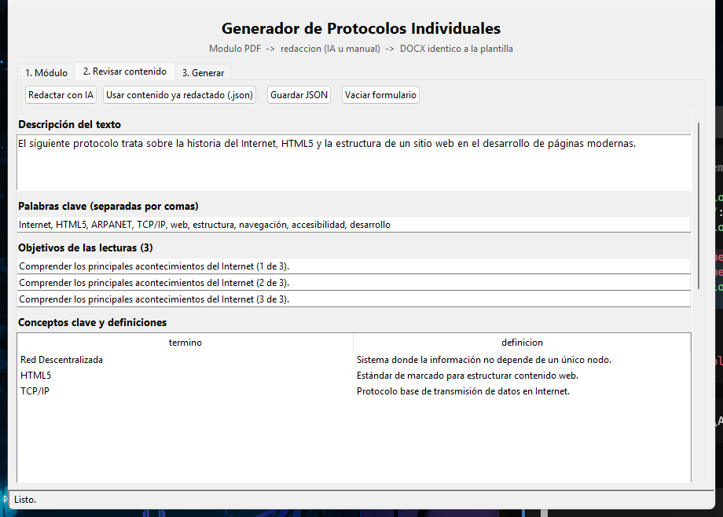

# Generador de Documentos (DOCX)




Herramienta con interfaz gráfica (Tkinter) que **convierte un PDF de lectura en un documento DOCX con formato idéntico a una plantilla**: extrae el texto del PDF, lo redacta con una IA (o a mano), y lo ensambla clonando fila por fila la plantilla original — así el resultado mantiene tipografía, estilos y numeración exactos.

Pensado inicialmente para *Protocolos Individuales* universitarios, pero **se adapta a cualquier tipo de documento** (informes, resúmenes, monografías…) cambiando la plantilla — ver [la guía](#guia-hacer-cualquier-tipo-de-documento).

---

## Características

- **3 pestañas**: cargar módulo → revisar/redactar contenido → generar DOCX.
- **Extracción de PDF**: texto nativo con `pypdf`; si el PDF es escaneado, intenta **OCR** (Tesseract) automáticamente.
- **Redacción con IA**: OpenAI, OpenRouter, **Groq** y **Gemini (Google AI Studio)**, incluidos sus niveles gratuitos.
- **Ensamblado por "clonado"**: copia los párrafos *modelo* de cada celda de la plantilla (deepcopy a nivel XML) y solo sustituye el texto → se heredan sangrías, negritas, tabulaciones y enumLst exactas.
- **Verificador de calidad**: revisa que el DOCX generado tenga los títulos y la estructura esperados.
- **Corrección automática**: si la IA devuelve JSON incompleto, reintenta con *feedback* del error; si el modelo ya no existe (404), intenta con el modelo por defecto.
- **Lanzador sin consola** (`Iniciar_Silencioso.vbs` / acceso directo).

## Requisitos

- Python 3.10+ (probado en 3.14, Windows).
- Opcional para OCR: [Tesseract](https://github.com/tesseract-ocr/tesseract) instalado y en el PATH.
- Una clave de API gratuita (opcional si se escribe el contenido a mano).

```bash
pip install -r generador/requirements.txt
```

## Uso

```bash
python run_generador.py
```

En Windows puedes dar doble clic a **`Iniciar_Silencioso.vbs`** (no abre ventana de consola) o al acceso directo generado.

Flujo típico:

1. **Pestaña 1 — Módulo**: selecciona el PDF (`Modulo N.pdf`). La unidad se deduce del nombre y se corrige a mano si hace falta. Pulsa *Extraer texto*.
2. **Pestaña 2 — Revisar contenido**: pulsa *Redactar con IA* (necesita clave configurada) o escribe el formulario a mano (descripción, palabras clave, objetivos, conceptos, resumen, conclusiones, bibliografía). Guarda/carga en JSON si quieres.
3. **Pestaña 3 — Generar**: configura el proveedor y clave, y pulsa *Generar protocolo (DOCX)*. El resultado aparece en `generador/salida/`.

### Proveedores de IA y niveles gratuitos

| Proveedor | Endpoint usado por defecto | Modelo por defecto | Clave de entorno |
|---|---|---|---|
| `openai` | `https://api.openai.com/v1` | `gpt-4o-mini` | `OPENAI_API_KEY` |
| `openrouter` | `https://openrouter.ai/api/v1` | `gpt-4o-mini` | `OPENROUTER_API_KEY` |
| `groq` | `https://api.groq.com/openai/v1` | `llama-3.3-70b-versatile` | `GROQ_API_KEY` |
| `google` | `https://generativelanguage.googleapis.com/v1beta/openai/` | `gemini-3.6-flash` | `GEMINI_API_KEY` |

- **Groq** y **Gemini** tienen nivel gratuito sin tarjeta (crear clave en [console.groq.com](https://console.groq.com) o [aistudio.google.com/apikey](https://aistudio.google.com/apikey)).
- Con `personalizado` puedes usar cualquier API compatible con OpenAI (Cerebras, Mistral, NVIDIA NIM…) indicando su **URL base**.
- La clave se puede **recordar** en la pestaña 3 (guarda en `generador/.config_ia.json`, que está excluido del repositorio por ser un secreto).

---

## Cómo funciona el ensamblado

`generador/core/protocol_builder.py` espera una plantilla con **una tabla de 9 filas × 1 columna**:

| Fila | Contenido |
|---|---|
| 0 | Bloque de título (contiene `1°`/`2°` para autosustituir la unidad) |
| 1 | Sección 1 — *DESCRIPCION* |
| 2 | Sección 2 — *PALABRAS CLAVES* |
| 3 | Sección 3 — *OBJETIVOS* |
| 4 | Sección 4 — *CONCEPTOS* |
| 5 | Sección 5 — *RESUMEN* |
| 6 | Sección 6 — *METODOLOGIA* (se copia **tal cual**, es el texto fijo del documento) |
| 7 | Sección 7 — *CONCLUSIONES* |
| 8 | Sección 8 — *BIBLIOGRAFIA* |

En cada fila, el **primer párrafo es el título** (identifica la sección) y los **siguientes párrafos son los "modelos"**: el generador los clona (uno por ítem) y solo reemplaza el texto. Por eso el documento generado se ve idéntico a la plantilla.

El resultado se verifica con `generador/core/verificador.py` (títulos exactos, estructura, ausencia de celdas vacías).

---

## Guía: hacer cualquier tipo de documento

El "núcleo" es fijo y sencillo: **plantilla DOCX → contenido JSON → DOCX final**. Para otro tipo de documento (informe, monografía, acta, guía…) hay dos niveles de adaptación.

### Nivel 1 — Misma estructura, otro contenido (rápido)

Si tu documento nuevo también cabe en las 7 secciones del formulario (descripción, palabras clave, objetivos, conceptos, resumen, conclusiones, bibliografía), solo tienes que **reemplazar la plantilla**:

1. Abre en Word `Protocolo_Plantilla.docx` (o crea un documento desde cero) y deja **un único párrafo de título** al inicio de cada fila 1-8 con el texto de las secciones.
2. Guarda tu documento como `generador/plantilla/Protocolo_Plantilla.docx` (misma estructura 9×1).
3. Genera. El texto *modelo* de cada celda fija el estilo de los párrafos nuevos; puedes pre-cargarlos con contenido parecido al esperado para que la IA respete el tono.

> **Tips de estilo**: si quieres secciones con subtítulos en negrita (como RESUMEN), deja el primer modelo en **negrita**; para sangrías con primera línea, que el modelo las tenga; para conceptos con el término en negrita y `:` seguido de tabulador, deja un párrafo con dos runs así.

### Nivel 2 — Estructura distinta (personalizado)

El generador se adapta tocando 4 puntos (todos en `generador/core/` y `generador/gui.py`):

1. **`protocol_builder.py` → dict `FILAS`**: declara tus nombres de fila (clave = número de fila). `build_protocol()` rellena cada celda con `_rellenar(celda(N), ...)` y un *modo* (`texto`, `objetivos`, `conceptos` o `resumen`).
2. **`ia_client.py` → `_prompt_usuario()`**: define el **esquema JSON** que pedirá a la IA, con las claves que tu documento necesita. La lista `ESQUEMA_REQUERIDO` recoge esas claves.
3. **`ia_client.py` → `validar_esquema()` y `protocol_builder.py` → `validar_contenido()`**: sincroniza los campos obligatorios con tu nuevo esquema si cambias nombres.
4. **`gui.py` → pestaña 2**: el formulario está ligado a las 7 claves; para campos nuevos, añade las filas en `_crear_tab_contenido()` y usa el mismo patrón (un `tk.Text` o `ttk.Entry` + lectura/escritura en `_obtener_contenido()` / `_mostrar_contenido()`).
5. **`verificador.py` → `secciones`**: actualiza la lista de títulos esperados (con punto final) para el control de calidad.
6. **`protocol_builder.py` → `_cambiar_unidad()` (fila 0)**: si tu documento no usa unidades, omite esa llamada o adapta el reemplazo.

### Si NO tienes una plantilla previa

Cualquier DOCX de referencia sirve: transforma su contenido a **una tabla de 9×1** en Word (Insertar → Tabla) y reparte tus secciones respetando la fila 0 (bloque de título) y la fila 6 (bloque fijo). El resto del pipeline funciona igual.

---

## Estructura del proyecto

```
Prouni/
├── run_generador.py                 # Entry point (auto-relaunch sin consola)
├── Iniciar_Silencioso.vbs           # Lanzador Windows sin ventana
├── Iniciar_Generador.bat            # Lanzador alternativo
├── generador/
│   ├── gui.py                       # Interfaz Tkinter (3 pestañas, hilos en background)
│   ├── requirements.txt
│   ├── plantilla/Protocolo_Plantilla.docx   # ⭐ plantilla (tu documento de ejemplo)
│   ├── assets/                      # icono de la app + script que lo genera
│   ├── salida/                      # DOCX generados (ignorado en git)
│   └── core/
│       ├── pdf_utils.py             # extracción de PDF, deducción de unidad, OCR
│       ├── ia_client.py             # proveedores IA, prompts y validación JSON
│       ├── protocol_builder.py      # ensamblado DOCX por clonado
│       └── verificador.py           # control de calidad del DOCX final
```

## Solución de problemas

- **La rueda del ratón no scrolla agujeros** — usamos un gestor global: en pestañas con formulario largo scrolla la página; sobre campos de texto/listas scrolla el propio campo.
- **Error `IA no devolvió JSON válido`** — el modelo cortó la respuesta: la app reintenta automáticamente con *feedback* y mayor presupuesto de tokens.
- **`404 model ... not found`** — el modelo ya no existe en tu cuenta; la app intenta el modelo por defecto del proveedor automáticamente.
- **Se abre una consola al arrancar** — usa `Iniciar_Silencioso.vbs` o el acceso directo; `run_generador.py` ya se relanza solo con `pythonw`.
- **Nivel gratuito agotado (Gemini: 5 rpm / 20 rpd)** — una generación = 1 llamada; con uso normal de 2-4 al día sobra.

## Notas

- El repositorio **no incluye** ni tus claves de API, ni los PDFs de módulos (material del curso), ni los DOCX generados.
- Icono regenerable: `python generador/assets/crear_icono.py`.

## Licencia

[MIT](LICENSE)